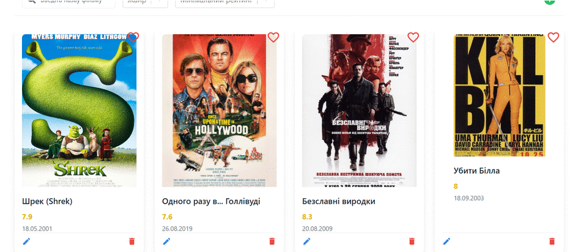

# 📊  Movie library

[Click here to see DEMO LINK](https://filmlib.vercel.app)

## 🚀 Project Overview

Сonvenient web application for managing your personal movie collection. With this app, you can:

- Browse a list of movies with essential information (poster, title, rating, release date)
- Add new movies to your collection
- Edit movie information
- Mark movies as favorites
- Quickly find desired movies using search functionality
- Access detailed information about each movie (description, actors, director, genre)

The application features an intuitive and responsive interface that works seamlessly on both desktop and mobile devices. All movie information is securely stored in a database, allowing you to access your collection from any device.


### Screenshot



## 🛠 Tech Stack

- **Frontend**: React
- **State Management**: Redux
- **Styling**: Tailwind CSS
- **HTTP Client**: Axios
- **Additional Libraries**:
  - React-toastify
  - React-select
  - React-icons
  - Use-debounce
    
- **Beckend**: Node.js, Express
- **Additional Libraries**:
  - Mongoose
  - Dotenv
  - Cors
  - Nodemon

## 🔧 Installation

### Prerequisites
- Node.js v22.11.0
- npm v10.9.0

### Setup

1. Clone the repository
```bash
git clone https://github.com/yahohulia/libraryOfFilm.git
cd libraryOfFilm
```

2. Start server
```bash
cd server
npm install
make .env file with DB_URI
npm start
or
npm run dev (for development)
```

3. Start client
```bash
cd client
npm install
npm start
```

## 🔧 Usage

Once the app is running, you can:

- Browse and search through your movie collection
- Add new movies with details like title, rating, and release date
- Edit existing movie information
- Mark movies as your favorites
- View detailed movie information including cast, director, and genre
- Search movies by title for quick access
- Get a clear overview of your movie collection
- View movie details on a dedicated page for each film
